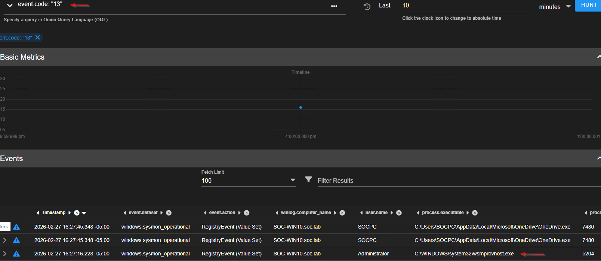

# Lab Name: Lab-1-Persistence.md
**Date:** 2026-02-27
**Category:** Persistance / Threat Hunting
**Tools Used:** Powershell / security onion / sysmon

## 1. Objective
The goal was to simulate a common persistence technique (Registry Run Key) and demonstrate how an analyst can identify this unauthorized change by using and IDS and event veiwer. 

## 2. Environment Setup
* **Endpoint:** Windows 10/11 VM (Home Lab)
* **Security Tooling:**  security onion / sysmon
* **Attack Tool:** Powershell from a remote server.  

## 3. Investigation Steps (The "Process")
Describe the steps you took. Use code blocks for commands.
1. **Activity Generation:** Using a remote endpoint, I created a backdoor persistance in the run key.  Invoke-Command -computername soc-win10 -scriptblock {New-ItemProperty -Path "HKCU:\Software\Microsoft\Windows\CurrentVersion\Run" -Name "Backdoor" -Value "C:\Windows\System32\notepad.exe"}
2. **Observation:** I checked my security onion as there was a detection for a possible lateral movement. I noticed in the alert the user-agent was WinRM client. This is used to send secure commands on windows machines. I need to investigate and see if ther was an attacker using LOLBins. I noticed the ip address destination was a local windows machine.
3. **The Hunt:** I used security onion and sysmon

## 4. Findings & Artifacts

* **Evidence 1:** 
detection for a possible lateral movement. I noticed in the alert the user-agent was WinRM client. This used to send secure commands on windows machines. Need to investigate and see if ther was an attacker using LOLBins. I noticed the ip address destination was a local windows machine.

* **Evidence 2:**
I went on the hunt section in security onion and searched for sysmon event id 13. I saw wsmprovhost.exe which is used with WinRM client. ALso the event action was showing registry event which matches and also the time of the event correlates with the lateral movement alert. When I opened the event I saw image wsmprovhost.exe, targetobject "backdoor". This shows that an attacker created a persistence using the run key.

## 5. Analysis & MITRE Mapping
* **Technique:** T1547.001
* **Analysis:** This is a melicious scenario because the attacker created a backdoor registry in run key which is used for persistance. They used LOLBins to attempt to stay hidden from AVs and other security tools. 

## 6. Conclusion / Remediation
Once you analyise and confirm its malicious we need to Delete the unauthorized registry key and terminate the malicious process instance. using the seucrty onion we know it came from a remove endpoint. We need to check the securty onion if other devices have communicated with this device and if possible isolate the source device. If its a device that has hijacked when need to further investigate that machine.
